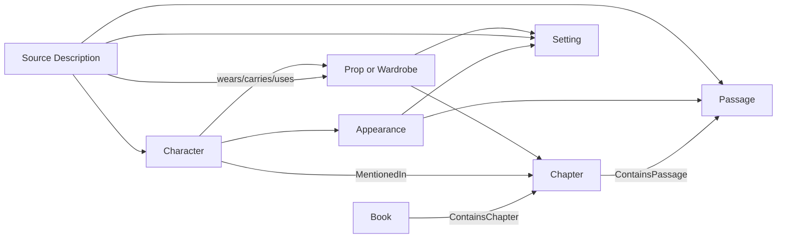

# Local Cradle Lore Graph

This folder builds a fully local, source-cited lore system from the authorized
PDF copies at `../1unsouled.pdf` and `../2soulsmith.pdf`. It does not call
Gemini, OpenAI, or another hosted model.

## Why a graph plus retrieval

The requested outputs are relational rather than a flat vector collection. A
character can appear in several chapters and settings; each appearance can
have several source descriptions; wardrobe and props can connect to a
character, setting, chapter, and exact passage. LadybugDB stores those links as
an embedded property graph queried with Cypher. Passage nodes also carry BM25
and BGE-M3 vector indexes, so semantic/lexical retrieval finds the graph entry
points.



The JSONL files in `data/` are the reproducible interchange/source layer.
LadybugDB stores source passages plus BM25/vector indexes; the complete derived
relationship graph is prebuilt into `data/service_index.json` and the catalogs
under `output/`. This split avoids unstable high-volume native derived-node
writes observed with LadybugDB under WSL2 while preserving hybrid retrieval.

## Installation

From the repository root:

```bash
.venv/bin/pip install -r lore_graph/requirements.txt
```

## Full build

All commands are resumable unless noted:

```bash
PYTHONPATH=lore_graph .venv/bin/python -m loredb.cli ingest
PYTHONPATH=lore_graph .venv/bin/python -m loredb.embed
PYTHONPATH=lore_graph .venv/bin/python -m loredb.cli index
PYTHONPATH=lore_graph .venv/bin/python -m loredb.extract
PYTHONPATH=lore_graph .venv/bin/python -m loredb.treatments
PYTHONPATH=lore_graph .venv/bin/python -m loredb.resolve_aliases
PYTHONPATH=lore_graph .venv/bin/python -m loredb.rebuild_graph
PYTHONPATH=lore_graph .venv/bin/python -m loredb.export_catalog
PYTHONPATH=lore_graph .venv/bin/python -m lore_api.build_indexes
PYTHONPATH=lore_graph .venv/bin/python -m loredb.validate
```

### Resume after reboot or interruption

From the repository root, run:

```bash
.venv/bin/python lore_graph/resume_processing.py
```

This validates every existing JSONL line before continuing. Successful passage
extractions and treatments are skipped; errors are retried. It then rebuilds
aliases, the derived graph, exported catalogs, and the API service index before
strict validation writes the final completion marker.

`extract` processes all 427 passages with the local Qwen2.5-VL 3B model. Every
description must contain an exact substring of its source passage. Unsupported
model-generated quotations are discarded and recorded under
`evidence_rejections`. Named and unnamed/non-speaking/background characters
are included; mentioned-only characters are distinguished from visually
present characters.

The final requested deliverables are exported under `output/`:

- `cast.jsonl`: cast entries linked to chapters, appearances, settings, source
  descriptions, and props/wardrobe.
- `settings.jsonl`: scenery/set entries linked to characters, items, chapters,
  passages, and visual descriptions.
- `props_wardrobe.jsonl`: items linked to characters, settings, chapters,
  passages, and visual descriptions.
- `chapter_treatments.jsonl`: one screenwriter-style treatment per chapter.

## Query examples

Hybrid BM25/vector passage retrieval:

```bash
PYTHONPATH=lore_graph .venv/bin/python -m loredb.query search \
  "How is Lindon's wooden badge worn and marked?"
```

Source-linked character dossier:

```bash
PYTHONPATH=lore_graph .venv/bin/python -m loredb.query character "Lindon"
```

## Important quality constraints

- PDF text is preserved locally and is never sent to a hosted service.
- Generated normalized descriptions never replace verbatim evidence.
- Book, chapter, page range, passage ID, and PDF checksum preserve provenance.
- Screenwriter treatments are generated independently from the source
  passages and never serve as evidence for visual facts.
- Unnamed character IDs are scoped to their passage until an explicit entity
  resolution pass establishes that two appearances are the same person.
- Human review remains necessary for ambiguous pronouns, aliases, groups, and
  visually implied but unnamed participants.

## FastAPI and MCP service

The final build creates `data/service_index.json`. Start the combined REST and
MCP server from the repository root:

```bash
.venv/bin/python lore_graph/serve.py --host 127.0.0.1 --port 8765
```

Use `--host 0.0.0.0` only when another machine must reach the service, and put
authentication/TLS in a reverse proxy before exposing copyrighted source text
outside a trusted network. REST documentation is available at
`http://127.0.0.1:8765/docs`; the Streamable HTTP MCP endpoint is
`http://127.0.0.1:8765/mcp/`.

An MCP client entry can point directly at that URL:

```json
{
  "mcpServers": {
    "cradle-lore": {
      "type": "streamable-http",
      "url": "http://127.0.0.1:8765/mcp/"
    }
  }
}
```

The same five operations are exposed through MCP tools and REST routes:

| MCP tool | REST route | Purpose |
| --- | --- | --- |
| `locate_lore_context` | `POST /v1/lore/locate` | Match a frame, transcript, highlighted Pegasus summary, or free-text description to complete cited scene contexts. |
| `locate_character_context` | `POST /v1/characters/locate` | Resolve a normalized character ID or character description, including first mention. |
| `locate_scenery_context` | `POST /v1/scenery/locate` | Resolve normalized scenery or a location description, including first mention. |
| `locate_prop_context` | `POST /v1/props/locate` | Return at most ten source-linked prop/wardrobe matches, including first appearances. |
| `ground_enhance` | `POST /v1/lore/ground-enhance` | Confirm a book location, then locally ground visible characters, scenery, and props and produce a concise Z-Image Turbo prompt. |

`ground_enhance` deliberately uses two calls. The first accepts a frame and
Pegasus chapter context and returns ranked passage candidates with
`requires_confirmation: true`. Repeat the call with the selected
`confirmed_passage_ids` to run the enhancement stages. Each response includes
an immutable visual inventory. Lore context is reported separately and cannot
introduce off-frame figures, scenery, or props into the visible description or
the final ComfyUI prompt. After the category passes, a dedicated
`continuity_audit` pass rechecks visible count, placement, posture, head and
eye direction, expression, action, appearance, prop contact, and background
geometry. A deterministic visual-lock appendix carries those facts into both
the grounded description and the final ComfyUI prompt. The response cache
version is bumped whenever these stage contracts change.

The main Z-Image pipeline uses the same staged tool for Phase 1 by default:

```bash
.venv/bin/python generate_prompts_from_metadata.py \
  --grounding-confirmations lore_graph/grounding_confirmations.json
```

The confirmation file maps normalized frame paths to passage IDs returned by
the first tool call. Frames without confirmations stop at candidate discovery.
For enhanced frames, `metadatagen.jsonl` preserves
`grounded_enhanced_description` and `ground_enhancement_stages` immediately
before `base_prompt_text`, the rich local-model Z-Image refinement. The final
controlled rendering variant remains in `prompt_text` and is what Phase 2 sends
to ComfyUI.
The same record also includes `extracted_facts`, separate source-cited fact
tables for visible characters, scenery, and props.
Use `--no-ground-enhance` only to run the legacy Qwen-only prompt path.

Example description-only lookup:

```bash
curl -sS -X POST http://127.0.0.1:8765/v1/lore/locate \
  -H 'content-type: application/json' \
  -d '{"description":"Lindon examines his wooden badge","max_locations":3}'
```

`frame_image` accepts either a path beneath this repository or an image data
URI. The image is interpreted locally by Qwen2.5-VL and never uploaded. The
frame interpretation and complete assembled responses are cached persistently
in `cache/lore_api.sqlite3`; BM25/vector indexes and the entity service index
are prebuilt by `finish_processing.py`.

`GET /health` reports `processing` until the exhaustive build, validation, and
final index replacement have all succeeded and `data/processing_complete.json`
has been written. A partial developer index is therefore never advertised as a
finished corpus.

Stop a running lore server before rebuilding the graph. The API opens LadybugDB
read-only, but the rebuild requires an exclusive writer lock; restart the API
afterward so it loads the new corpus fingerprint and service index.

Run the source-grounded semantic acceptance suite after a completed build:

```bash
PYTHONPATH=lore_graph .venv/bin/python lore_graph/tests/acceptance_queries.py
```

It checks the Lindon wooden/Empty badge prop, Elder Whisper's fox/tails visual
identity, the source-grounded Shi garden/mountain roses/cloudbell/grass around
Kelsa and Lindon's Empty Palm practice, and a cited `locate_lore_context` result.

## Local `uvx`/stdio MCP package for coding agents

The HTTP endpoint remains available as described above. The same four tools are
also packaged as a stdio MCP executable named `cradle-lore-mcp`, allowing Codex
and other coding agents to start the server themselves through `uvx`.

Test the local package from the repository root:

```bash
uvx --from ./lore_graph cradle-lore-mcp
```

The process speaks MCP over stdin/stdout, so it normally appears to wait silently
when launched by hand. Press Ctrl-C to stop it. MCP clients manage its lifecycle.

Add it to Codex CLI using the absolute local package path:

```bash
codex mcp add cradle-lore \
  --env CRADLE_PROJECT_ROOT=/home/joezen777/cradleai \
  -- uvx --from /home/joezen777/cradleai/lore_graph cradle-lore-mcp
```

Equivalent `~/.codex/config.toml` configuration:

```toml
[mcp_servers.cradle-lore]
command = "uvx"
args = [
  "--from",
  "/home/joezen777/cradleai/lore_graph",
  "cradle-lore-mcp",
]
startup_timeout_sec = 120
tool_timeout_sec = 3600
enabled = true

[mcp_servers.cradle-lore.env]
CRADLE_PROJECT_ROOT = "/home/joezen777/cradleai"
```

Restart Codex after adding the server, then use `/mcp` or `codex mcp list` to
confirm that `cradle-lore` and its four tools are enabled.

The wheel contains the completed graph, service index, passage embeddings,
extractions, treatments, and exported catalogs. Mutable response caching is
stored outside the installed package at `~/.cache/cradle-lore-mcp/` by default.
Override it with `CRADLE_LORE_CACHE_DIR` if desired.

Embedding and optional frame-interpretation model weights use the normal host
Hugging Face cache. This avoids copying more than 11 GB of identical model files
into each `uvx` environment while keeping inference local. The machine must
already have `BAAI/bge-m3`; frame-image lookups additionally require
`Qwen/Qwen2.5-VL-3B-Instruct` and CUDA. Text, character, scenery, and prop
lookups require only the embedding model.
